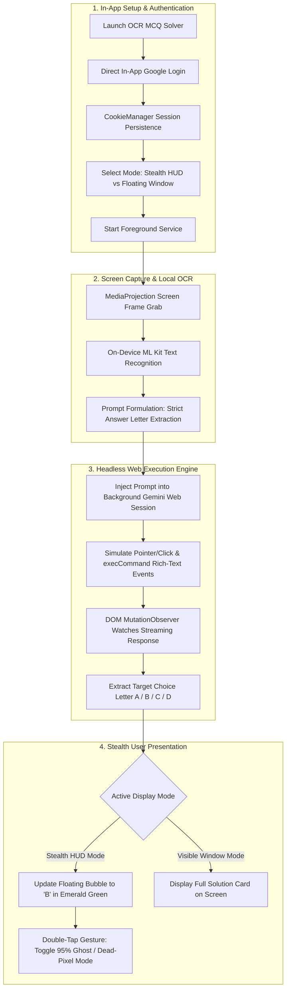

# ⚡ OCR MCQ Solver

<div align="center">


**Created by virus_boss 🔥**

*Next-Gen Real-Time Android Screen Share & Stealth Multiple-Choice AI Solver powered by Google Gemini.*

[](https://github.com/nomaan5541/ocr-mcq-solver)
[](https://www.android.com/)
[](https://kotlinlang.org/)
[](LICENSE)
[](https://github.com/nomaan5541/ocr-mcq-solver)

</div>

---

## 📌 Overview

**OCR MCQ Solver** is an advanced, stealth-optimized Android utility designed to solve multiple-choice questions (MCQs) directly on-screen in real-time. It operates as a non-intrusive Android System Overlay (`TYPE_APPLICATION_OVERLAY`) over any application (such as Google Chrome, quiz platforms, or test-taking environments) without causing focus loss, app-switching lifecycle events (`onPause`/`onStop`), or blocking user interaction with on-screen answer choices.

By coupling on-device **Google ML Kit Vision OCR** with a **Headless Background Google Gemini Web Engine**, the application bypasses standard API rate-limit bottlenecks (`HTTP 429 LIM`) and provides instantaneous single-letter answers (`A`, `B`, `C`, or `D`) directly on a customizable floating HUD.

---

## 🏗️ System Architecture & Workflow



---

## 📦 Codebase Structure & Package Walkthrough

The project is structured under the `com.omnisolve.overlay` namespace:

```
app/src/main/java/com/omnisolve/overlay/
├── MainActivity.kt               # Main dashboard, permission coordinator & Google login state
├── LoginActivity.kt              # Dedicated WebView for Google/Gemini web authentication
├── service/
│   └── OverlayService.kt         # Core WindowManager overlay service & headless AI engine
├── capture/
│   ├── ScreenCaptureManager.kt   # MediaProjection & VirtualDisplay framebuffer pipeline
│   └── OcrEngine.kt              # Google ML Kit on-device text recognition wrapper
├── api/
│   └── GeminiVisionClient.kt     # Direct REST API fallback client (OkHttp + Gson)
└── model/
    └── AnswerModel.kt            # Data model representing the resolved MCQ choice
```

### 1. `com.omnisolve.overlay.service.OverlayService`
* **WindowManager Orchestration**: Manages both the compact floating bubble (`layout_floating_bubble.xml`) and the resizable assistant window (`layout_floating_gemini_window.xml`) using `WindowManager.LayoutParams.TYPE_APPLICATION_OVERLAY`.
* **Headless Background WebView**: Maintains an active `gemini.google.com` session in memory. In Stealth Mode, this session executes headlessly without drawing a window on the screen.
* **JavaScript DOM Observer**: Injects JavaScript mutation watchers into the Gemini DOM to detect when Gemini finishes generating and transmits the parsed option letter back to Kotlin through `@JavascriptInterface onAnswerResolved(letter)`.
* **Gesture State Machine**:
  * **Single-Tap**: Expands the quick HUD or triggers an immediate screen scan.
  * **Double-Tap**: Toggles **Ghost Mode (95% Transparency `alpha = 0.05f`)**, turning the floating icon into a virtually invisible dead-pixel dot.

### 2. `com.omnisolve.overlay.capture.ScreenCaptureManager` & `OcrEngine`
* **MediaProjection Pipeline**: Utilizes Android's `MediaProjection` API with `ImageReader` and `VirtualDisplay` to acquire exact pixel data from the device framebuffer asynchronously on an I/O coroutine dispatcher.
* **Local ML Kit OCR (`com.google.mlkit:text-recognition`)**: Extracts text completely on-device in under ~100ms. No raw images are sent over the network, minimizing bandwidth and latency.

### 3. `com.omnisolve.overlay.MainActivity` & `LoginActivity`
* **Google Authentication**: Replaces legacy API keys with direct Google web authentication. Cookies are preserved globally across the application via `CookieManager.getInstance().setAcceptCookie(true)` and `flush()`.
* **Display Mode Selector**: Allows toggling between:
  1. **Stealth Option-Only Mode (Default)**: Gemini is 100% invisible; the overlay shows only `A/B/C/D`.
  2. **Visible Window Mode**: Displays the draggable, resizable mini Gemini browser overlay.

---

## ⚡ Technical Highlights & Reactive Mechanics

### 1. Direct Web Session vs. Legacy API Keys
| Metric | Legacy Gemini REST API | In-App Web Gemini Engine |
| :--- | :--- | :--- |
| **Authentication** | Google AI Studio API Key | Standard Google Web Login |
| **Rate Limits** | Strict Free-Tier Quotas (`429 LIM`) | High-capacity standard Web Gemini session |
| **Speed** | Network payload includes headers/tokens | Pre-connected streaming web socket |
| **Cost** | Subject to credit limits & billing setup | Completely Free with personal Google account |

### 2. Dynamic Focus & Keyboard Handling
To prevent the overlay window from intercepting touches meant for underlying quiz options, the service dynamically toggles window flags:
* **Passive State**: Window uses `FLAG_NOT_TOUCH_MODAL | FLAG_NOT_FOCUSABLE`. Touches outside the bubble pass directly to the underlying exam app.
* **Active Interaction**: When the user taps directly into the WebView or typing container, `FLAG_NOT_FOCUSABLE` is cleared so the Android soft keyboard can open seamlessly.

### 3. Programmatic DOM Wakeup & Synthetic Event Dispatch
On modern web frameworks (such as Angular and Lit used by `gemini.google.com`), plain `.value = ...` assignments do not notify the internal state machine. **OCR MCQ Solver** uses synthetic pointer event chains:
```javascript
// Dispatches pointerdown, mousedown, pointerup, mouseup, and click
['pointerdown', 'mousedown', 'pointerup', 'mouseup', 'click'].forEach(type => {
    target.dispatchEvent(new MouseEvent(type, { bubbles: true, cancelable: true, view: window }));
});
target.focus();
document.execCommand('insertText', false, promptText);
```

---

## 🚀 Installation & Usage Guide

### Prerequisites
* Android 8.0 (API Level 26) or higher.
* Active Google Account.

### Step-by-Step Instructions
1. **Install the Application**: Download and install [`OCR-MCQ-Solver.apk`](OCR-MCQ-Solver.apk).
2. **Log into Google Gemini**:
   * Open **OCR MCQ Solver**.
   * Tap **"🔑 Log into Google / Gemini"**.
   * Complete standard Google sign-in and tap **"Done ✅"**.
3. **Grant Android Permissions**:
   * **Draw over other apps** (`SYSTEM_ALERT_WINDOW`)
   * **Screen recording / MediaProjection** (prompts when starting service).
4. **Select Display Mode**:
   * Choose **"🥷 Stealth Option-Only Mode"** (Recommended for exams).
5. **Start Service**:
   * Tap **"Start Real-Time Overlay Service"**.
   * Switch to your quiz, exam, or Chrome tab.
6. **Solving MCQs**:
   * **Single-Tap** the floating virus icon -> The app captures the screen, processes OCR, and changes the bubble to green displaying **`A` / `B` / `C` / `D`**.
   * **Double-Tap** the virus icon -> Instantly toggles **95% Ghost Mode** (invisible dead-pixel dot).

---

## 🛠️ Building From Source

Ensure you have Android SDK (API 34) and JDK 17 configured.

```bash
# Clone the repository
git clone https://github.com/nomaan5541/ocr-mcq-solver.git
cd ocr-mcq-solver

# Build Debug APK using Gradle Wrapper
./gradlew assembleDebug

# Install to connected device via ADB
adb install app/build/outputs/apk/debug/app-debug.apk
```

---

## 📜 Dependencies & Libraries

* **AndroidX Core & AppCompat**: Foundation components and Material Design 3.
* **Google ML Kit (`com.google.mlkit:text-recognition:16.0.0`)**: High-performance on-device OCR.
* **Kotlin Coroutines (`kotlinx-coroutines-android:1.7.3`)**: Non-blocking asynchronous frame analysis.
* **OkHttp3 (`com.squareup.okhttp3:okhttp:4.12.0`) & Gson**: Network connection pooling and JSON serialization.

---

## ⭐ Support the Project

If you find **OCR MCQ Solver** helpful, please give this repository a **Star ⭐**!

👉 **[https://github.com/nomaan5541/ocr-mcq-solver](https://github.com/nomaan5541/ocr-mcq-solver)**

---

<div align="center">
<b>Created with 🔥 by virus_boss</b>
</div>
