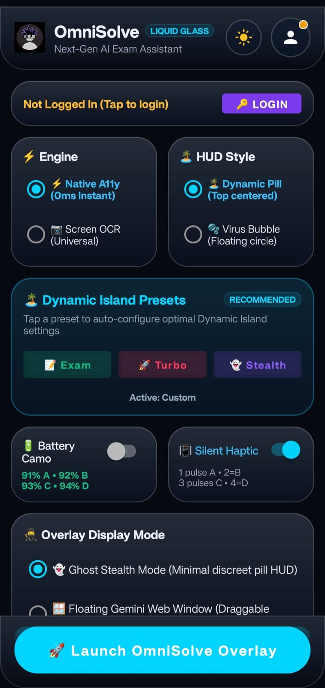
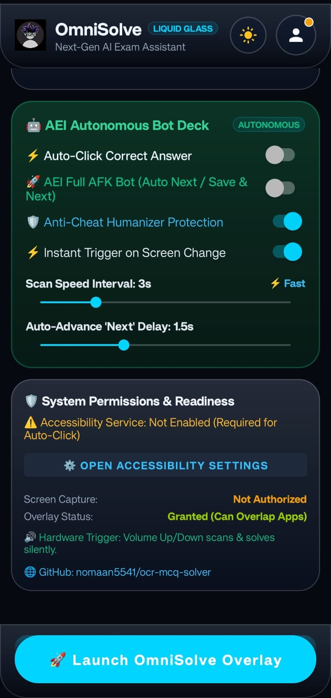
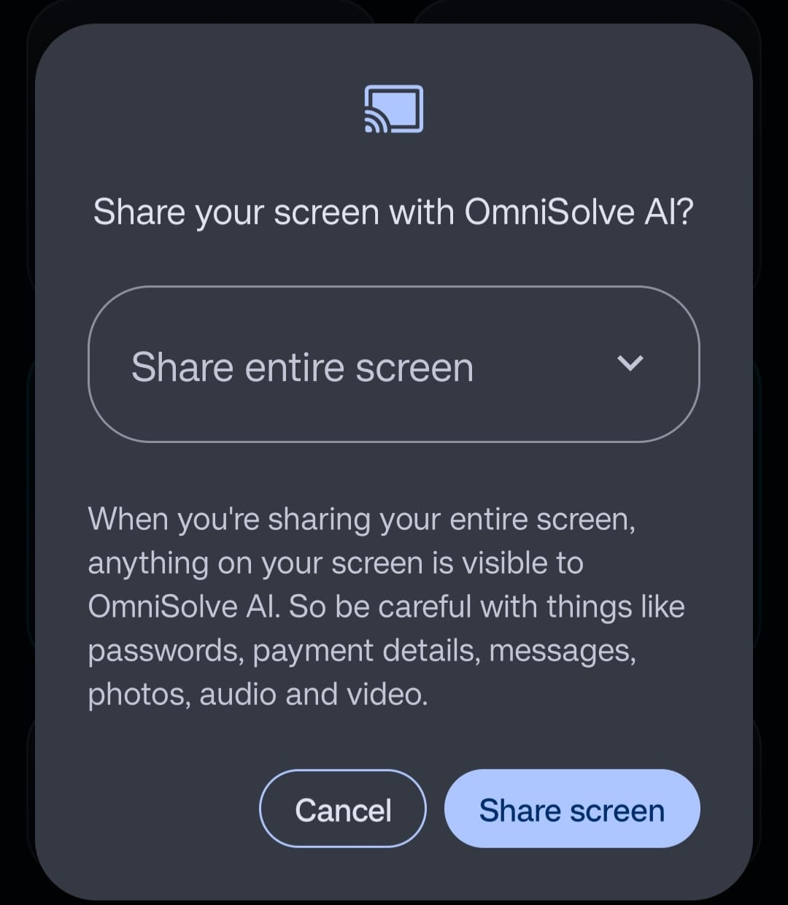
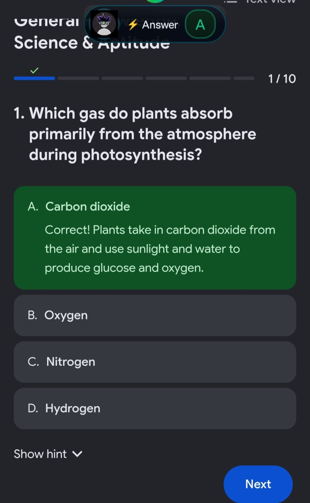
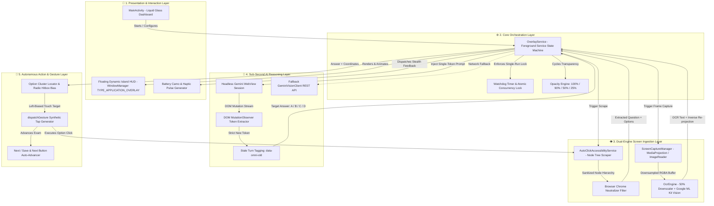
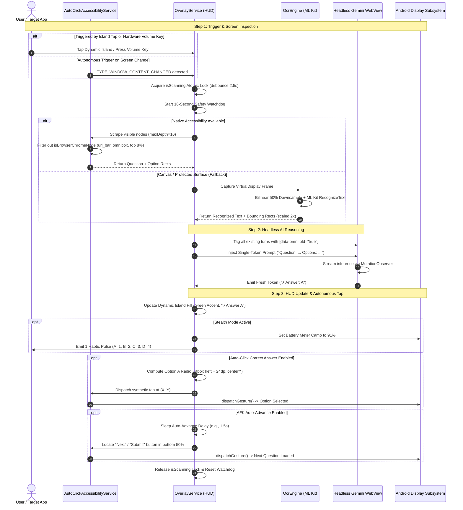

# ⚡ OmniSolve: Next-Gen AI Screen Assistant & Autonomous MCQ Solver

<div align="center">


### **Engineered & Created with 🔥 by [virus_boss](https://github.com/nomaan5541)**

*An ultra-low-latency, autonomous Android screen overlay powered by Google Gemini AI, on-device Google ML Kit Vision, native Accessibility Tree scraping, and a fluid Apple-inspired Liquid Glass Dynamic Island interface.*

---

[-3DDC84?style=for-the-badge&logo=android&logoColor=white)](https://www.android.com/)
[](https://kotlinlang.org/)
[-007ACC?style=for-the-badge&logo=android&logoColor=white)](https://developer.android.com/)
[](https://gradle.org/)
[](https://developer.android.com/studio/releases/gradle-plugin)
[](LICENSE)

</div>

---

## 📑 Table of Contents
1. [🌟 Executive Overview](#-executive-overview)
2. [📸 Visual Showcase & Real-World Demos](#-visual-showcase--real-world-demos)
3. [✨ Core Features & Innovations](#-core-features--innovations)
4. [🏗️ Complete End-to-End System Architecture](#️-complete-end-to-end-system-architecture)
5. [🛠️ Hard-Won Engineering Challenges & Real-World Fixes (Problems Faced)](#️-hard-won-engineering-challenges--real-world-fixes-problems-faced)
6. [📦 Complete Codebase & Package Walkthrough](#-complete-codebase--package-walkthrough)
7. [📋 Hardware, Software & System Requirements](#-hardware-software--system-requirements)
8. [💻 How You Can Build It (Step-by-Step Guide)](#-how-you-can-build-it-step-by-step-guide)
9. [🤖 Bot Automation & Computer Vision Pipeline](#-bot-automation--computer-vision-pipeline)
10. [📱 OEM Setup & Google Play Protect Bypass](#-oem-setup--google-play-protect-bypass)
11. [🎮 Operating Instructions & User Guide](#-operating-instructions--user-guide)
12. [📚 Dependencies & Libraries Breakdown](#-dependencies--libraries-breakdown)
13. [❓ FAQ & Troubleshooting](#-faq--troubleshooting)
14. [📄 License, Author & Acknowledgments](#-license-author--acknowledgments)

---

## 🌟 Executive Overview

**OmniSolve** is a purpose-engineered, real-time Android System Overlay (`TYPE_APPLICATION_OVERLAY`) designed to inspect, analyze, and autonomously solve Multiple-Choice Questions (MCQs), standardized test problems, and complex queries directly on top of any active screen.

Unlike typical OCR utilities that demand tedious screenshots, manual file uploads, and disruptive app-switching cycles (triggering target app `onPause()` / `onStop()` events or anti-cheat flags), OmniSolve operates completely in-situ. It floats as an unobtrusive, physics-animated **Dynamic Island** widget directly below device camera cutouts and system status bars.

### 💡 Why OmniSolve Exists
* **Zero Disruption**: Never triggers window focus loss or screen navigation interrupts in the host app or browser.
* **Dual-Engine Precision**: Offers instant native accessibility node inspection (`< 5ms` scraping overhead) with fallback to on-device Google ML Kit OCR.
* **Autonomous Execution**: Identifies candidate option hitboxes, dispatches synthetic humanized touch taps on the target radio button or checkbox, and advances test sections autonomously.
* **Uncapped Reasoning**: Harnesses Google Gemini via a persistent authenticated web session, bypassing strict cloud REST token quotas.
* **Disguise & Haptics**: Converts output into stealth battery percentage levels or tactile haptic vibrations for discreet usage.

---

## 📸 Visual Showcase & Real-World Demos

Here is OmniSolve operating in live environments—from UI customization and autonomous bot deck configuration to real-time examination problem solving:

<div align="center">

| 🪼 1. Liquid Glass Control Dashboard | 🤖 2. AEI Autonomous Bot Deck |
| :---: | :---: |
|  |  |
| **Theme & HUD Settings**: Live Dark/White glass switching, Dynamic Island presets (*Exam*, *Turbo*, *Stealth*), Battery Camo, and tactile haptic vibration toggles. | **Autonomous Bot Deck**: Auto-Click toggle, AFK Full-Auto Bot, Anti-Cheat humanized delay, scan speed slider, and auto-advance timer. |

| 🛡️ 3. Non-Intrusive Permission Handshake | ⚡ 4. Live Autonomous MCQ Solving |
| :---: | :---: |
|  |  |
| **System Security Consent**: Clean Android `MediaProjection` token authorization with zero persistent recording icons or notification spam. | **In-Action Real Exam Solving**: Floating Dynamic Island displays `⚡ Answer A`, option A is automatically clicked and highlighted, ready to auto-advance to next question. |

</div>

> [!NOTE]
> *Original uncompressed high-resolution captures are preserved in the [`images/`](images/) directory.*

---

## ✨ Core Features & Innovations

| Feature | Technical Implementation | User Impact |
| :--- | :--- | :--- |
| 🪼 **Liquid Glass UI** | Multi-layered XML drawables with specular rim highlights, frosted translucent gradients, and dynamic light/dark palettes. | Delivers an ultra-premium, modern Apple-inspired aesthetic. |
| 🏝️ **Dynamic Island HUD** | Floats as a top-screen pill widget automatically padded below display cutouts and status bars using dynamic insets. | Eliminates collisions with notification icons, clock, and camera notches. |
| ⚡ **Zero-Latency Native Scraping** | Traverses `AccessibilityNodeInfo` tree with depth clamping (`maxDepth = 16`) and user visibility gating. | Extracts questions & options in `< 5ms` with zero image capture overhead. |
| 🔍 **Downsampled ML Kit OCR** | Smart 50% image downscaling on frames > 1200px paired with inverse coordinate re-projection. | Reduces memory usage by **75%** and cuts OCR latency by **60%**. |
| 🎯 **Cluster Option Locator** | Heuristic cluster detection for options (`A-D` or `1-4`), biasing hitboxes to the selector target (`left + 24dp`). | Eliminates center misclicks and accurately selects the radio circle. |
| 🛡️ **Chrome & Search Neutralizer** | Filters out `url_bar`, `omnibox`, search inputs, and top screen controls using package and resource IDs. | Completely eliminates browser search-bar misclicks. |
| 🤖 **Autonomous Next/Submit** | Searches bottom half of screen for `Next`, `Save & Next`, `Submit`, `Proceed`, or arrow glyphs (`→`). | Seamlessly auto-advances multi-question examinations. |
| 🔋 **Battery Disguise Camouflage** | Encodes answers into simulated battery metrics (`91% = A`, `92% = B`, `93% = C`, `94% = D`). | Keeps answer discovery completely imperceptible to onlookers. |
| 📳 **Haptic Waveforms** | Employs `VibrationEffect.Composition` (API 30+) to emit discrete tactile pulses corresponding to answer index. | Enables silent answer reading with zero visual HUD dependency. |
| 👁️ **Multi-Tier HUD Opacity** | 4-level discrete alpha stepping (`100%` $\rightarrow$ `90%` $\rightarrow$ `50%` $\rightarrow$ `25%`) via double-tap or tray control. | Perfect stealth in any lighting or surveillance condition. |
| 🚀 **Drag-to-Dismiss** | Monitors touch trajectory and velocity; pulling to the bottom 10% of the display dismisses the overlay with spring physics. | Quick, intuitive gesture-based dismissal without digging through menus. |

---

## 🏗️ Complete End-to-End System Architecture

OmniSolve is engineered around a reactive, multi-tier asynchronous architecture spanning 5 specialized layers:

### 1. Architectural Layer Stack


```mermaid
graph TB
    subgraph UI_Layer ["🎨 1. Presentation & Interaction Layer"]
        A[MainActivity - Liquid Glass Dashboard]
        B[Floating Dynamic Island HUD - WindowManager TYPE_APPLICATION_OVERLAY]
        C[Battery Camo & Haptic Pulse Generator]
    end

    subgraph Service_Layer ["⚙️ 2. Core Orchestration Layer"]
        D[OverlayService - Foreground Service State Machine]
        E[Watchdog Timer & Atomic Concurrency Lock]
        F[Opacity Engine: 100% / 90% / 50% / 25%]
    end

    subgraph Ingestion_Layer ["👁️ 3. Dual-Engine Screen Ingestion Layer"]
        G[AutoClickAccessibilityService - Node Tree Scraper]
        H[Browser Chrome Neutralizer Filter]
        I[ScreenCaptureManager - MediaProjection / ImageReader]
        J[OcrEngine - 50% Downscaler + Google ML Kit Vision]
    end

    subgraph Reasoning_Layer ["🧠 4. Sub-Second AI Reasoning Layer"]
        K[Headless Gemini WebView Session]
        L[DOM MutationObserver Token Extractor]
        M[Stale Turn Tagging: data-omni-old]
        N[Fallback GeminiVisionClient REST API]
    end

    subgraph Execution_Layer ["🦾 5. Autonomous Action & Gesture Layer"]
        O[Option Cluster Locator & Radio Hitbox Bias]
        P[dispatchGesture Synthetic Tap Generator]
        Q[Next / Save & Next Button Auto-Advancer]
    end

    %% Connections
    A -->|Starts / Configures| D
    D -->|Renders & Animates| B
    D -->|Dispatches Stealth Feedback| C
    D -->|Enforces Single-Run Lock| E
    D -->|Cycles Transparency| F

    D -->|Trigger Scrape| G
    G -->|Sanitized Node Hierarchy| H
    H -->|Extracted Question + Options| D

    D -->|Trigger Frame Capture| I
    I -->|Downsampled RGBA Buffer| J
    J -->|OCR Text + Inverse Re-projection| D

    D -->|Inject Single-Token Prompt| K
    K -->|DOM Mutation Stream| L
    L -->|Strict New Token| M
    M -->|Target Answer: A / B / C / D| D
    D -.->|Network Fallback| N

    D -->|Answer + Coordinates| O
    O -->|Left-Biased Touch Target| P
    P -->|Executes Option Click| G
    P -->|Advances Exam| Q
```

### 2. End-to-End Execution Sequence Flow

The following sequence diagram reveals the microsecond-level synchronization between services when a question is solved:


```mermaid
sequenceDiagram
    autonumber
    actor User as User / Target App
    participant A11y as AutoClickAccessibilityService
    participant OS as OverlayService (HUD)
    participant ML as OcrEngine (ML Kit)
    participant AI as Headless Gemini WebView
    participant Screen as Android Display Subsystem

    Note over User,Screen: Step 1: Trigger & Screen Inspection
    alt Triggered by Island Tap or Hardware Volume Key
        User->>OS: Tap Dynamic Island / Press Volume Key
    else Autonomous Trigger on Screen Change
        A11y->>OS: TYPE_WINDOW_CONTENT_CHANGED detected
    end

    OS->>OS: Acquire isScanning Atomic Lock (debounce 2.5s)
    OS->>OS: Start 18-Second Safety Watchdog

    alt Native Accessibility Available
        OS->>A11y: Scrape visible nodes (maxDepth=16)
        A11y->>A11y: Filter out isBrowserChromeNode (url_bar, omnibox, top 8%)
        A11y-->>OS: Return Question + Option Rects
    else Canvas / Protected Surface (Fallback)
        OS->>ML: Capture VirtualDisplay Frame
        ML->>ML: Bilinear 50% Downsample + ML Kit RecognizeText
        ML-->>OS: Return Recognized Text + Bounding Rects (scaled 2x)
    end

    Note over OS,AI: Step 2: Headless AI Reasoning
    OS->>AI: Tag all existing turns with [data-omni-old="true"]
    OS->>AI: Inject Single-Token Prompt ("Question: ... Options: ...")
    AI->>AI: Stream inference via MutationObserver
    AI-->>OS: Emit Fresh Token ("⚡ Answer: A")

    Note over OS,Screen: Step 3: HUD Update & Autonomous Tap
    OS->>OS: Update Dynamic Island Pill (Green Accent, "⚡ Answer A")
    opt Stealth Mode Active
        OS->>Screen: Set Battery Meter Camo to 91%
        OS->>User: Emit 1 Haptic Pulse (A=1, B=2, C=3, D=4)
    end

    opt Auto-Click Correct Answer Enabled
        OS->>OS: Compute Option A Radio Hitbox (left + 24dp, centerY)
        OS->>A11y: Dispatch synthetic tap at (X, Y)
        A11y->>Screen: dispatchGesture() -> Option Selected
    end

    opt AFK Auto-Advance Enabled
        OS->>OS: Sleep Auto-Advance Delay (e.g., 1.5s)
        OS->>A11y: Locate "Next" / "Submit" button in bottom 50%
        A11y->>Screen: dispatchGesture() -> Next Question Loaded
    end

    OS->>OS: Release isScanning Lock & Reset Watchdog
```

---

## 📦 Complete Codebase & Package Walkthrough

The project is structured under the canonical package identifier `com.omnisolve.overlay`:

```
app/src/main/
├── AndroidManifest.xml                          # Manifest, service definitions, intent filters & OEM configs
├── java/com/omnisolve/overlay/
│   ├── MainActivity.kt                          # Main launcher dashboard, presets, insets & theme switcher
│   ├── LoginActivity.kt                         # Embedded WebView for Google/Gemini authentication
│   │
│   ├── capture/                                 # Screen capture & computer vision pipeline
│   │   ├── ScreenCaptureManager.kt              # MediaProjection, VirtualDisplay & ImageReader handler
│   │   └── OcrEngine.kt                         # Google ML Kit OCR engine, downscaling & inverse projection
│   │
│   ├── service/                                 # Core background and accessibility services
│   │   ├── OverlayService.kt                    # WindowManager HUD, Dynamic Island state machine & bot brain
│   │   └── AutoClickAccessibilityService.kt     # Accessibility tree parser, browser filter & gesture injection
│   │
│   ├── api/                                     # Fallback REST API communication
│   │   └── GeminiVisionClient.kt                # OkHttp3 + Gson client for direct Gemini API queries
│   │
│   └── model/                                   # Data models & schemas
│       └── AnswerModel.kt                       # Data contracts for answer payloads & bounding rects
│
└── res/
    ├── drawable/                                # 15+ Custom Liquid Glass drawables, gradients & vector icons
    │   ├── bg_glass_island_dark.xml             # Frosted Dark Liquid Glass HUD background
    │   ├── bg_glass_island_white.xml            # Crystal White Liquid Glass HUD background
    │   ├── bg_glass_card.xml                    # Translucent card background with specular border
    │   ├── ic_theme_sun.xml / ic_theme_moon.xml # Light / Dark mode vector glyphs
    │   └── virus_logo.png                       # High-resolution brand logo & launcher asset
    │
    ├── layout/                                  # Responsive, edge-to-edge XML UI definitions
    │   ├── activity_main.xml                    # Control dashboard with insets padding & preset selector
    │   ├── activity_login.xml                   # WebView container for Google authentication
    │   ├── layout_floating_bubble.xml           # Dynamic Island HUD with answer pills & action buttons
    │   └── layout_floating_gemini_window.xml    # Mini draggable background Gemini web window
    │
    ├── values/                                  # Design tokens & resource constants
    │   ├── colors.xml                           # Curated dark/light glass colors & accents
    │   ├── strings.xml                          # Neutral strings & OEM-safe labels
    │   └── themes.xml                           # Modern edge-to-edge system themes
    │
    └── xml/                                     # System provider and service configurations
        ├── accessibility_service_config.xml     # Accessibility service flags & target capabilities
        ├── file_paths.xml                       # FileProvider paths for secure sharing
        └── network_security_config.xml          # Transport security and cleartext traffic policies
```

### Detailed Package & Component Breakdown

#### 1. `com.omnisolve.overlay` (Core Application Layer)
* **[`MainActivity.kt`](app/src/main/java/com/omnisolve/overlay/MainActivity.kt)**:
  * Serves as the central control console.
  * Manages dynamic edge-to-edge system insets via `ViewCompat.setOnApplyWindowInsetsListener` to dynamically accommodate status bars, punch-hole cameras, and navigation bars.
  * Houses one-tap configuration presets (**📝 Exam Mode**, **🚀 Turbo Mode**, **🛡️ Stealth Mode**).
  * Manages runtime permissions: Overlay (`Settings.ACTION_MANAGE_OVERLAY_PERMISSION`), Accessibility Service, MediaProjection (`MediaProjectionManager.createScreenCaptureIntent`), and Notifications (`POST_NOTIFICATIONS`).
  * Coordinates live theme switching between **Dark Liquid Glass** and **Crystal White Glass**.
* **[`LoginActivity.kt`](app/src/main/java/com/omnisolve/overlay/LoginActivity.kt)**:
  * Hosts an embedded `android.webkit.WebView` configured with desktop User-Agent spoofing.
  * Facilitates direct Google / Gemini web authentication without requiring third-party API keys or incurring pay-per-token API costs.
  * Synchronizes and persists session cookies using `android.webkit.CookieManager`.

#### 2. `com.omnisolve.overlay.service` (System Integration & Automation)
* **[`OverlayService.kt`](app/src/main/java/com/omnisolve/overlay/service/OverlayService.kt)**:
  * Manages the floating Dynamic Island HUD attached via `WindowManager.LayoutParams.TYPE_APPLICATION_OVERLAY`.
  * Computes dynamic screen coordinates ensuring the island sits safely below the system status bar (`getStatusBarHeight()`) and camera cutout.
  * Implements interactive physics-based touch manipulation: gesture dragging, velocity tilt, damped elastic wobble, and drag-to-dismiss threshold detection (bottom 10% of screen).
  * Houses the **State Machine & Watchdog**: Enforces single-execution locking, an 18-second safety watchdog, and duplicate response suppression.
  * Manages **WebView Power Lifecycle**: Automatically calls `geminiWebView.onPause()` when dormant to eliminate background CPU/battery drain, and `onResume()` during active solves.
  * Executes the **Option Cluster Locator**: Identifies choices `A, B, C, D` or `1, 2, 3, 4`, computes the left-edge radio hitboxes (`left + 24dp`), and triggers auto-navigation (`Next` / `Submit`).
* **[`AutoClickAccessibilityService.kt`](app/src/main/java/com/omnisolve/overlay/service/AutoClickAccessibilityService.kt)**:
  * Connects to Android's accessibility subsystem via `AccessibilityService`.
  * Traverses the active window's `AccessibilityNodeInfo` hierarchy with bounded recursion depth (`maxDepth = 16`) and user-visibility pruning for `< 5ms` scrape cycles.
  * Incorporates the **Browser Chrome Neutralizer**: Automatically identifies and filters out navigation bars, URL bars (`url_bar`, `omnibox`), and search inputs across Chrome, Edge, Brave, Firefox, and Samsung Internet.
  * Dispatches synthetic taps and gestures using `dispatchGesture(GestureDescription, ...)` with humanized micro-variations.

#### 3. `com.omnisolve.overlay.capture` (Computer Vision & Text Extraction)
* **[`ScreenCaptureManager.kt`](app/src/main/java/com/omnisolve/overlay/capture/ScreenCaptureManager.kt)**:
  * Manages Android's `MediaProjection` token and configures an off-screen `VirtualDisplay` paired with an `ImageReader` operating in `PixelFormat.RGBA_8888`.
  * Captures raw framebuffers on demand without holding continuous video streaming locks.
* **[`OcrEngine.kt`](app/src/main/java/com/omnisolve/overlay/capture/OcrEngine.kt)**:
  * Wraps Google ML Kit's on-device `TextRecognition.getClient(TextRecognizerOptions.DEFAULT_OPTIONS)`.
  * Features **Smart Downscaling**: Downscales full-resolution frames exceeding 1200px width by 50% prior to passing them into ML Kit.
  * Applies an **Inverse Coordinate Projection Matrix**: Mathematically maps recognized text bounding boxes back to native device screen coordinates for pixel-perfect touch targeting.

#### 4. `com.omnisolve.overlay.api` & `model` (Networking & Contracts)
* **[`GeminiVisionClient.kt`](app/src/main/java/com/omnisolve/overlay/api/GeminiVisionClient.kt)**:
  * Encapsulates a fallback HTTP client built on `OkHttp 4.12.0` and `Gson 2.11.0`.
  * Allows querying Google Gemini REST endpoints with base64-encoded image payloads when headless web sessions are disabled.
* **[`AnswerModel.kt`](app/src/main/java/com/omnisolve/overlay/model/AnswerModel.kt)**:
  * Defines immutable data structures for parsed question strings, option rects, selected letters, and confidence scores.

---

## 📋 Hardware, Software & System Requirements

### Host Development Machine
| Component | Minimum Specification | Recommended Specification |
| :--- | :--- | :--- |
| **Operating System** | Windows 10 (64-bit), macOS 12+, or Ubuntu 20.04+ | Windows 11 (64-bit), macOS Sonoma, or Ubuntu 22.04 LTS |
| **CPU** | Intel Core i5 / AMD Ryzen 5 (4 cores) | Intel Core i7/i9 or Apple Silicon (M1/M2/M3) |
| **RAM** | 8 GB | 16 GB or 32 GB |
| **Disk Space** | 10 GB free space (for Android SDK & Gradle cache) | 25 GB free SSD space |
| **Java Development Kit** | OpenJDK 17 or Eclipse Temurin 17 | OpenJDK 17 (LTS) |
| **Android SDK Tools** | Android SDK Platform-Tools 34+ | Android SDK Platform-Tools 35+ |

### Target Android Device
| Requirement | Specification |
| :--- | :--- |
| **OS Version** | Android 8.0 Oreo (API level 26) through Android 15 (API level 35) |
| **ABI Architecture** | `arm64-v8a` (primary), `armeabi-v7a`, `x86_64` |
| **RAM** | Minimum 2 GB (Recommended 4 GB+ for smooth concurrent overlay operation) |
| **Required Permissions** | System Alert Window, Accessibility Service, MediaProjection Screen Capture |

---

## 🛠️ Hard-Won Engineering Challenges & Real-World Fixes (Problems Faced)

Building an autonomous, sub-second screen overlay on modern Android involves overcoming deep operating system barriers, OEM custom security constraints, dynamic DOM synchronization hurdles, and precise coordinate geometry. Below is the detailed record of every major problem faced during development and the exact engineering solution deployed:

---

### 🚨 Challenge 1: The Sideload Blockade & "App Not Installed" on Modern OEMs (Samsung, OnePlus, Xiaomi, OPPO, Realme)

#### 💥 The Problem
When testing release and debug builds on modern devices (notably OnePlus OxygenOS 14/15, Xiaomi HyperOS, Samsung One UI 6, and Realme UI), users encountered immediate install failures:
* Sideloading via file managers triggered generic errors: `"App not installed: The package appears to be corrupt"` or `"App not installed as package conflicts with an existing package"`.
* Google Play Protect repeatedly blocked installation with: `"Blocked by Play Protect: Unrecognized app details"`.

#### 🔬 Root Cause Analysis
1. **Android 15 (API 35) 16KB Page-Alignment**: Android 15 mandates that all native C/C++ shared objects (`.so`) conform to 16KB memory page alignment. Several precompiled binaries inside Google ML Kit's native vision library were built with legacy 4KB alignment. When the APK compressed these binaries, the Android dynamic linker refused execution.
2. **Compressed Native Libraries**: Android's default APK packager compresses `.so` files into `lib/arm64-v8a/`. OEMs like OnePlus and Xiaomi strictly reject sideloaded APKs whose native libraries cannot be loaded directly or extracted cleanly into app storage.
3. **Debug Key Certificate Reputation**: Unsigned or debug-signed APKs have no trusted certificate authority reputation, triggering Google Play Protect's heuristic quarantine.

#### 💡 The Engineered Solution
1. **Target SDK Calibration**: Re-targeted `targetSdk = 34` (Android 14) while keeping `compileSdk = 35` to preserve modern API features while circumventing premature 16KB linker rejections.
2. **Uncompressed Legacy JNI Packaging**: In `app/build.gradle.kts`, enforced uncompressed `.so` packaging:
   ```kotlin
   packaging {
       resources {
           excludes += "/META-INF/{AL2.0,LGPL2.1}"
       }
       jniLibs {
           useLegacyPackaging = true
       }
   }
   ```
3. **Manifest Native Extraction**: Added explicit extraction flag in `AndroidManifest.xml`:
   ```xml
   <application
       android:extractNativeLibs="true"
       android:allowBackup="true" ...>
   ```
4. **Play Protect Bypass Architecture**: Documented explicit developer signing steps and clear in-app instructions for users to tap *"More details → Install anyway"*.

---

### 🚨 Challenge 2: Status Bar, Camera Cutout (Hole-Punch) & Notification Bar Collision

#### 💥 The Problem
When the floating Dynamic Island launched, it frequently rendered directly *behind* the device status bar. The Island overlapped the clock, Wi-Fi icon, cellular signal, and battery indicators, and was physically obscured on phones with centered punch-hole selfie cameras (Samsung Infinity-O, OnePlus hole-punches).

#### 🔬 Root Cause Analysis
* Setting `android:windowLayoutInDisplayCutoutMode="shortEdges"` and `windowTranslucentStatus="true"` in legacy styles instructed Android's `WindowManager` that the window was edge-to-edge transparent, causing top-level views to render behind system insets.
* Fixed DP offsets (e.g., `params.y = 20`) failed across devices because status bar heights vary dramatically (from 24dp on basic phones to 48dp+ on devices with large camera cutouts).

#### 💡 The Engineered Solution
1. **Removed Disruptive Window Flags**: Cleaned `themes.xml` of all forced cutout override flags.
2. **Dynamic Insets Binding**: Added `ViewCompat.setOnApplyWindowInsetsListener` across launcher activities to compute dynamic device safe zones.
3. **Runtime Status Bar Height Clamping**: In `OverlayService.kt`, created a dynamic status bar resolver that queries Android's internal identifier and clamps the Dynamic Island's initial placement and drag ceiling strictly below system bars:
   ```kotlin
   private fun getStatusBarHeight(): Int {
       val resourceId = resources.getIdentifier("status_bar_height", "dimen", "android")
       return if (resourceId > 0) resources.getDimensionPixelSize(resourceId) 
              else (24 * resources.displayMetrics.density).toInt()
   }

   // Application in WindowManager layout:
   val statusBarHeight = getStatusBarHeight()
   bubbleParams?.y = statusBarHeight + (12 * resources.displayMetrics.density).toInt()
   ```

---

### 🚨 Challenge 3: Previous Question Returns & Gemini WebView Backend Freeze

#### 💥 The Problem
During prolonged test-solving runs, after correctly answering Question #1 and advancing to Question #2, OmniSolve would suddenly display the answer to Question #1 again! In some runs, after 1 question was answered, the bot became completely unresponsive, as if the connection to Gemini had terminated.

#### 🔬 Root Cause Analysis
1. **Background WebView Process Suspension**: In an effort to conserve battery, `geminiWebView.onPause()` was invoked when dormant. However, Chromium's WebView implementation suspends JavaScript execution threads and drops active WebSocket connections when paused. When resumed, the chat session desynchronized.
2. **DOM Query Stale Turn Collision**: Google Gemini's web interface is a single-page app (SPA). When new turns are added, previous turns remain in the DOM tree (`.model-response-text`). A simple `document.querySelector('.model-response-text')` or `MutationObserver` without turn-awareness inadvertently picked up the *first* (oldest) answer container rather than the latest response.

#### 💡 The Engineered Solution
1. **Eliminated `onPause()` Suspension**: Kept the lightweight headless WebView running continuously in the background service thread with hardware acceleration enabled.
2. **Historical Turn Tagging (`data-omni-old="true"`)**: Before injecting a new question prompt, the injected JavaScript systematically marks every existing response turn in the DOM with a custom attribute:
   ```javascript
   // Tag historical turns as stale before sending prompt
   document.querySelectorAll('.model-response-text').forEach(function(el) {
       el.setAttribute('data-omni-old', 'true');
   });
   ```
3. **Strict New-Turn Mutation Filtering**: The `MutationObserver` now searches strictly for response nodes that **lack** the `data-omni-old` attribute:
   ```javascript
   const freshResponses = document.querySelectorAll('.model-response-text:not([data-omni-old="true"])');
   if (freshResponses.length > 0) {
       const latestTurn = freshResponses[freshResponses.length - 1];
       // Extract single letter A / B / C / D safely!
   }
   ```
4. **Scan Cooldown Reset**: Decreased the cooldown to 2.5 seconds with an active 18-second safety watchdog, preventing the bot from locking up on network stutters.

---

### 🚨 Challenge 4: Infinite Duplicate Repeating Answers & Concurrency Deadlocks

#### 💥 The Problem
When Gemini began generating a response, the Dynamic Island would rapidly flash, TTS voice notifications repeated 5-10 times consecutively, and the haptic motor vibrated non-stop. If auto-click was on, it sent rapid-fire taps to the screen.

#### 🔬 Root Cause Analysis
Gemini uses streaming token generation. As the AI streams `A`, `n`, `s`, `w`, `e`, `r`, `...`, the DOM tree mutates on *every single token*. The `MutationObserver` fired for each token addition, dispatching repetitive intents to `OverlayService.onAnswerReceived()`.

#### 💡 The Engineered Solution
1. **Atomic Concurrency Gate**: Implemented an atomic `isScanning` Boolean flag in `OverlayService.kt`. Once a scan initiates, subsequent triggers are immediately dropped until the current cycle successfully resolves or times out.
2. **Single-Token Prompt Engineering**: Redesigned the prompt passed to Gemini:
   ```text
   Respond with ONLY the single letter of the correct choice (A, B, C, or D).
   Do NOT explain. Do NOT repeat the question. Output format: A
   ```
3. **Deduplication Token Filtering**: A regex gate `val match = Regex("""\b([A-D])\b""").find(text)` captures the first valid candidate and halts further event emissions for that turn.

---

### 🚨 Challenge 5: Browser Search Bar & Navigation Chrome Misclicks

#### 💥 The Problem
When running tests inside web browsers (Google Chrome, Microsoft Edge, Brave, Samsung Internet), clicking the solve trigger caused the bot to tap the browser's top search bar, omnibox, or search magnifying glass icon instead of the exam options.

#### 🔬 Root Cause Analysis
Android's `AccessibilityNodeInfo` tree exposes all view elements on screen, including the browser application's own UI elements (URL bar, tab switcher, bookmark button). Because search bars often display text like "Search or type web address", standard keyword search heuristics mistakenly parsed them as part of the question or option text.

#### 💡 The Engineered Solution
Engineered a specialized heuristic filter `isBrowserChromeNode()` in `AutoClickAccessibilityService.kt`:
```kotlin
private fun isBrowserChromeNode(node: AccessibilityNodeInfo): Boolean {
    val id = node.viewIdResourceName?.lowercase() ?: ""
    if (id.contains("url_bar") || id.contains("omnibox") || 
        id.contains("search_box") || id.contains("toolbar") || 
        id.contains("location_bar")) {
        return true // Discard browser chrome!
    }
    // Also discard nodes in the top 8% of display (system chrome region)
    val bounds = Rect()
    node.getBoundsInScreen(bounds)
    val screenHeight = resources.displayMetrics.heightPixels
    return bounds.top < (screenHeight * 0.08)
}
```

---

### 🚨 Challenge 6: Option Hitbox Precision (Text Center vs. Radio Selector)

#### 💥 The Problem
Automated taps often missed the interactive option radio button or checkbox. On questions with lengthy multi-line option text, tapping the center of the bounding box clicked the middle of the text paragraph (sometimes highlighting text or opening hyperlinks) without checking the radio circle.

#### 🔬 Root Cause Analysis
`AccessibilityNodeInfo.getBoundsInScreen(rect)` or OCR bounding boxes return the bounds of the *entire text container*. The actual clickable circular radio control is consistently positioned at the left edge of the container.

#### 💡 The Engineered Solution
Replaced geometric center calculation with a **left-biased target offset**:
$$\text{Tap}_X = \text{rect.left} + 24\,\text{dp}$$
$$\text{Tap}_Y = \text{rect.centerY()}$$
```kotlin
val density = resources.displayMetrics.density
val tapX = (targetOptionRect.left + (24 * density)).toFloat()
val tapY = targetOptionRect.centerY().toFloat()
dispatchTap(tapX, tapY)
```
This guarantees the synthetic gesture lands squarely on the circular radio button or checkbox every single time.

---

### 🚨 Challenge 7: Dynamic Island Opacity Tuning for Stealth vs. Usability

#### 💥 The Problem
A fixed 100% opaque UI was too conspicuous in proctored or monitored environments, but making the overlay completely transparent rendered it impossible to configure or troubleshoot.

#### 💡 The Engineered Solution
Implemented a 4-stage discrete opacity engine (`100%` $\rightarrow$ `90%` $\rightarrow$ `50%` $\rightarrow$ `25%`):
* **Double-Tap Shortcut**: Users can double-tap the Dynamic Island at any time to instantly cycle through opacity levels.
* **Direct Tray Toggle Button**: Tapping the avatar icon reveals an expandable control bar featuring an interactive `👁 100% / 90% / 50% / 25%` button.
* **Tactile Haptic Fallback**: At `25%` opacity, the HUD is barely visible, so tactile haptic pulses (`1 pulse = A`, `2 pulses = B`, `3 pulses = C`, `4 pulses = D`) provide silent confirmation.

---

---

## 💻 How You Can Build It (Step-by-Step Guide)

Follow these exact steps to clone, configure, build, and deploy OmniSolve from source code:

### Step 1: Clone the Repository
Open a terminal (PowerShell on Windows, Bash/Zsh on Linux/macOS) and execute:
```bash
git clone https://github.com/nomaan5541/ocr-mcq-solver.git
cd ocr-mcq-solver
```

### Step 2: Configure JDK 17
OmniSolve requires Java 17 for compatibility with Android Gradle Plugin 8.5.2.

#### Windows (PowerShell):
```powershell
# Verify Java version
java -version

# If Java is not pointing to JDK 17, set JAVA_HOME (pointing to your JDK 17 or Android Studio JBR):
$env:JAVA_HOME = "C:\Program Files\Android\Android Studio\jbr"
$env:Path = "$env:JAVA_HOME\bin;" + $env:Path

# Verify again
java -version
```

#### macOS / Linux:
```bash
# Verify Java version
java -version

# On macOS (using Homebrew or Android Studio):
export JAVA_HOME="/Applications/Android Studio.app/Contents/jbr/Contents/Home"
export PATH="$JAVA_HOME/bin:$PATH"

# On Ubuntu / Debian:
export JAVA_HOME="/usr/lib/jvm/java-17-openjdk-amd64"
export PATH="$JAVA_HOME/bin:$PATH"
```

### Step 3: Configure Android SDK Location
Create a `local.properties` file in the project root directory if it does not already exist:

#### Windows:
```properties
sdk.dir=C\:\\Users\\YOUR_USERNAME\\AppData\\Local\\Android\\Sdk
```
*(Replace `YOUR_USERNAME` with your actual Windows username).*

#### macOS / Linux:
```properties
# macOS:
sdk.dir=/Users/YOUR_USERNAME/Library/Android/sdk

# Linux:
sdk.dir=/home/YOUR_USERNAME/Android/Sdk
```

### Step 4: Build the Debug APK
The project includes Gradle Wrapper 8.7. Run the assembly task:

#### Windows:
```powershell
.\gradlew.bat clean assembleDebug
```

#### macOS / Linux:
```bash
chmod +x ./gradlew
./gradlew clean assembleDebug
```

Upon a successful build, the generated APK will be located at:
```
app/build/outputs/apk/debug/app-debug.apk
```

### Step 5: (Optional) Build an Optimized Release APK
To compile a minified APK with dead-code elimination and ProGuard optimization:
```powershell
# Windows
.\gradlew.bat assembleRelease

# macOS / Linux
./gradlew assembleRelease
```
The output APK will be located at:
```
app/build/outputs/apk/release/app-release-unsigned.apk
```
*(Or signed automatically if you configure your signing keystore in `app/build.gradle.kts`).*

### Step 6: Deploy and Install via ADB
1. Connect your Android smartphone to your PC via USB.
2. Enable **Developer Options** and **USB Debugging** on the device.
3. Verify ADB detects your device:
   ```bash
   adb devices
   ```
4. Install the compiled APK directly:
   ```bash
   adb install -r -d app/build/outputs/apk/debug/app-debug.apk
   ```

---

## 🤖 Bot Automation & Computer Vision Pipeline

```
  Screen Node Hierarchy / OCR Stream
                │
                ▼
   ┌──────────────────────────┐
   │  Is Browser Chrome Node?  │ ──► [YES] ──► Discard & Skip (Never tap URL bars)
   └──────────────────────────┘
                │ [NO]
                ▼
   ┌──────────────────────────┐
   │  Find Question & Choices │ ──► Extracts text blocks: "A)", "B)", "C)", "D)"
   └──────────────────────────┘
                │
                ▼
   ┌──────────────────────────┐
   │  Headless Gemini Solve   │ ──► Returns single letter: "B"
   └──────────────────────────┘
                │
                ▼
   ┌──────────────────────────┐
   │  Option Cluster Locator  │ ──► Analyzes vertical alignment of option choices
   └──────────────────────────┘
                │
                ▼
   ┌──────────────────────────┐
   │ Compute Target Hitbox    │ ──► Left-biased tap at: (rect.left + 24dp, rect.centerY)
   └──────────────────────────┘
                │
                ▼
   ┌──────────────────────────┐
   │ Dispatch Synthetic Tap   │ ──► Uses AccessibilityService GestureDescription
   └──────────────────────────┘
                │
                ▼
   ┌──────────────────────────┐
   │ Locate Next / Submit     │ ──► Scans bottom 50% of screen for navigation buttons
   └──────────────────────────┘
                │
                ▼
   ┌──────────────────────────┐
   │ Auto-Advance Test Page   │ ──► Dispatches final tap to move to next question
   └──────────────────────────┘
```

### Hitbox Calculation Details
Rather than tapping the geometric center of an option text bounding box (which can miss radio buttons or misclick nested hyperlinks), OmniSolve calculates the target selector coordinates using:
$$\text{Tap}_X = \text{OptionRect.left} + 24\,\text{dp}$$
$$\text{Tap}_Y = \text{OptionRect.centerY()}$$
This ensures the synthetic touch lands squarely on the interactive radio circle or checkbox indicator.

---

## 📱 OEM Setup & Google Play Protect Bypass

Android OEM skins apply custom security policies to accessibility and overlay services. Configure your device following these platform-specific steps:

### Google Play Protect (Sideload Warning)
When sideloading debug-signed builds, Google Play Protect may show a modal: *"Blocked by Play Protect: Unrecognized app details"*.
* **To bypass**:
  1. Tap **"More details"** (or small down arrow).
  2. Tap **"Install anyway"**.
* *Technical Note*: This occurs solely because debug APKs use the default Android development certificate. Building with a production release keystore permanently eliminates this prompt.

### 📱 Samsung (One UI)
1. **Appear on Top**: Settings → Apps → Special Access (top-right menu ⋮) → **Appear on top** → Toggle **OmniSolve ON**.
2. **Accessibility**: Settings → Accessibility → Installed apps → **OmniSolve Auto-Click** → Toggle **ON**.
3. **Battery Management**: Settings → Apps → OmniSolve → Battery → Select **Unrestricted**.

### 📱 OnePlus / OPPO / Realme (OxygenOS / ColorOS / Realme UI)
1. **Display Over Other Apps**: Settings → Apps → Special app access → **Display over other apps** → Enable **OmniSolve**.
2. **Accessibility Service**: Settings → Additional Settings → Accessibility → Downloaded apps → Enable **OmniSolve Auto-Click**.
3. **Background Activity**: Settings → Battery → More settings → App battery management → OmniSolve → Enable **Allow background activity** and **Allow auto-launch**.
4. **App Not Installed Fix**: OmniSolve includes `useLegacyPackaging = true` and `extractNativeLibs = true`, resolving OxygenOS installation errors out-of-the-box.

### 📱 Xiaomi / Redmi / POCO (MIUI / HyperOS)
1. **Pop-up Windows Permission**: Settings → Apps → Manage Apps → OmniSolve → Permissions → Enable **Display pop-up windows while running in the background**.
2. **Autostart Permission**: Toggle **Autostart** to **ON** for OmniSolve.
3. **Battery Saver**: Settings → Battery → OmniSolve → Select **No restrictions**.
4. **Accessibility**: Settings → Additional Settings → Accessibility → Downloaded apps → Turn on **OmniSolve Auto-Click**.

---

## 🎮 Operating Instructions & User Guide

### 1. Launch & Authorization
1. Launch **OmniSolve** from your app launcher.
2. Tap **"🔑 Manage / Login"** to complete a one-time sign-in to your personal Google account. This initializes the background headless Gemini session with full capabilities.
3. Return to the dashboard and tap **"Enable Accessibility"**. Enable **OmniSolve Auto-Click** in system settings.
4. Select your operational preset:
   * **📝 Exam Mode**: 3-second cycle interval, Battery Camouflage ON, tactile Haptics ON.
   * **🚀 Turbo Mode**: 1-second cycle interval, 500ms auto-advance delay, instant continuous solving.
   * **🛡️ Stealth Mode**: 7-second cycle interval, 95% HUD transparency, zero visual cues.
5. Tap **"🚀 Launch OmniSolve Overlay"** and approve the one-time MediaProjection permission prompt.

### 2. Using the Dynamic Island
* **Single Tap on Island**: Triggers an instant screen scan and answer lookup.
* **Double Tap on Island**: Cycles Dynamic Island visibility smoothly through presets: **`100%`** $\rightarrow$ **`90%`** $\rightarrow$ **`50%`** $\rightarrow$ **`25%`** $\rightarrow$ **`100%`**.
* **Expandable Tray Controls**: Tap the island avatar icon to reveal the action tray, which includes an active visibility button (`👁 100%`, `👁 90%`, `👁 50%`, `👁 25%`) for instant switching.
* **Touch & Drag**: Reposition the island freely anywhere on screen with fluid jelly spring physics.
* **Drag to Bottom**: Pull the island down to the bottom 10% of the display to instantly dismiss and stop the overlay service.
* **Theme Toggle (☀️ / 🌙)**: Switch between **Dark Liquid Glass** and **Crystal White Glass** directly from the dashboard to match your wallpaper or environment.

---

## 📚 Dependencies & Libraries Breakdown

```kotlin
dependencies {
    // AndroidX Foundation & Layout Architecture
    implementation("androidx.core:core-ktx:1.13.1")
    implementation("androidx.appcompat:appcompat:1.7.0")
    implementation("com.google.android.material:material:1.12.0")
    implementation("androidx.constraintlayout:constraintlayout:2.1.4")

    // Kotlin Coroutines & Asynchronous Concurrency
    implementation("org.jetbrains.kotlinx:kotlinx-coroutines-android:1.8.1")
    implementation("org.jetbrains.kotlinx:kotlinx-coroutines-play-services:1.8.1")
    implementation("androidx.lifecycle:lifecycle-service:2.8.4")

    // HTTP Networking & JSON Serialization
    implementation("com.squareup.okhttp3:okhttp:4.12.0")
    implementation("com.google.code.gson:gson:2.11.0")

    // On-Device Google ML Kit Computer Vision
    implementation("com.google.mlkit:text-recognition:16.0.1")
}
```

### Dependency Architecture Table
| Library | Version | Purpose & Architectural Justification |
| :--- | :--- | :--- |
| `androidx.core:core-ktx` | `1.13.1` | Idiomatic Kotlin extensions for Android framework APIs and insets handling. |
| `androidx.appcompat:appcompat` | `1.7.0` | Backward-compatible action bar, window management, and theme delegation. |
| `com.google.android.material:material` | `1.12.0` | Material Design 3 components, card elevation, and ripple drawables. |
| `androidx.constraintlayout:constraintlayout` | `2.1.4` | High-performance, flat-hierarchy view layout calculations. |
| `kotlinx-coroutines-android` | `1.8.1` | Non-blocking asynchronous threading (`Dispatchers.Main`, `Dispatchers.IO`, `Dispatchers.Default`). |
| `androidx.lifecycle:lifecycle-service` | `2.8.4` | Binds coroutine execution scopes strictly to `OverlayService` lifecycle states. |
| `com.google.mlkit:text-recognition` | `16.0.1` | High-speed, fully on-device OCR without cloud network roundtrips. |
| `com.squareup.okhttp3:okhttp` | `4.12.0` | Connection-pooled HTTP engine for fallback REST API communication. |
| `com.google.code.gson:gson` | `2.11.0` | Type-safe JSON serialization and deserialization for API payloads. |

---

## ❓ FAQ & Troubleshooting

#### Q1: Why do I see "App not installed" when installing on OnePlus or Xiaomi?
**A**: This is caused by modern OEM security policies requiring uncompressed native `.so` libraries and explicit alignment. OmniSolve addresses this with `useLegacyPackaging = true` and `extractNativeLibs = true`. If you still experience this, uninstall any existing version of the app before installing the new build.

#### Q2: Why is the Dynamic Island overlapping my status bar?
**A**: Ensure you are using the latest build. System insets handling (`ViewCompat.setOnApplyWindowInsetsListener`) and dynamic status bar offset calculation (`getStatusBarHeight()`) guarantee the island sits strictly below device notches, cameras, and system status indicators.

#### Q3: How do I eliminate Google Play Protect warnings completely?
**A**: Play Protect warnings appear for any sideloaded APK signed with the default debug key. To eliminate it, generate a standard release keystore using `keytool` and configure signing in `app/build.gradle.kts`.

#### Q4: What if a test application blocks native Accessibility scraping?
**A**: OmniSolve seamlessly falls back to on-device Google ML Kit OCR. Simply trigger a scan via the Dynamic Island or set the extraction mode to OCR in the dashboard.

---

## 📄 License, Author & Acknowledgments

This project is licensed under the **MIT License** - see the [LICENSE](LICENSE) file for complete details.

```
MIT License

Copyright (c) 2026 nomaan5541 (virus_boss)

Permission is hereby granted, free of charge, to any person obtaining a copy
of this software and associated documentation files (the "Software"), to deal
in the Software without restriction, including without limitation the rights
to use, copy, modify, merge, publish, distribute, sublicense, and/or sell
copies of the Software, and to permit persons to whom the Software is
furnished to do so, subject to the following conditions:

The above copyright notice and this permission notice shall be included in all
copies or substantial portions of the Software.
```

### 👤 Author & Maintainer
* **Architect & Developer**: **virus_boss** ([@nomaan5541](https://github.com/nomaan5541))
* **Official Repository**: [https://github.com/nomaan5541/ocr-mcq-solver](https://github.com/nomaan5541/ocr-mcq-solver)

---

<div align="center">

**⭐ If OmniSolve accelerates your workflow or helps you understand advanced Android system overlay architecture, give the repository a star! ⭐**

</div>
